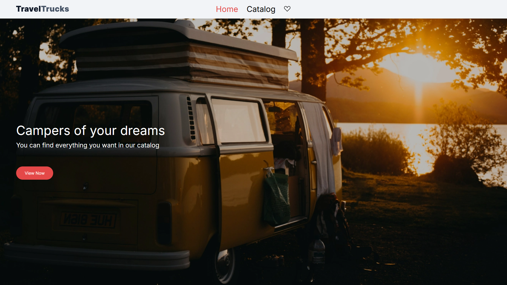
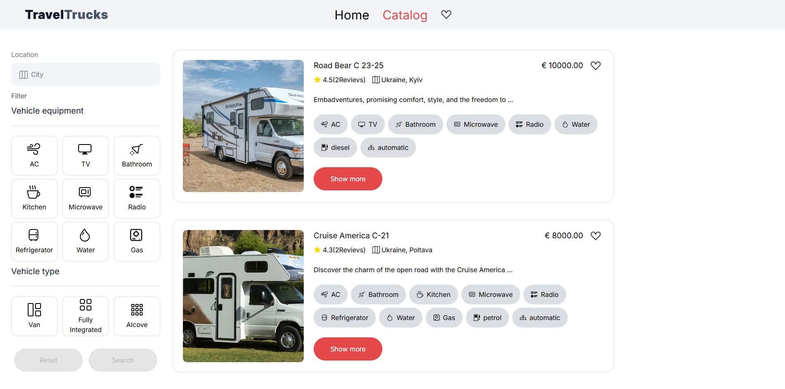
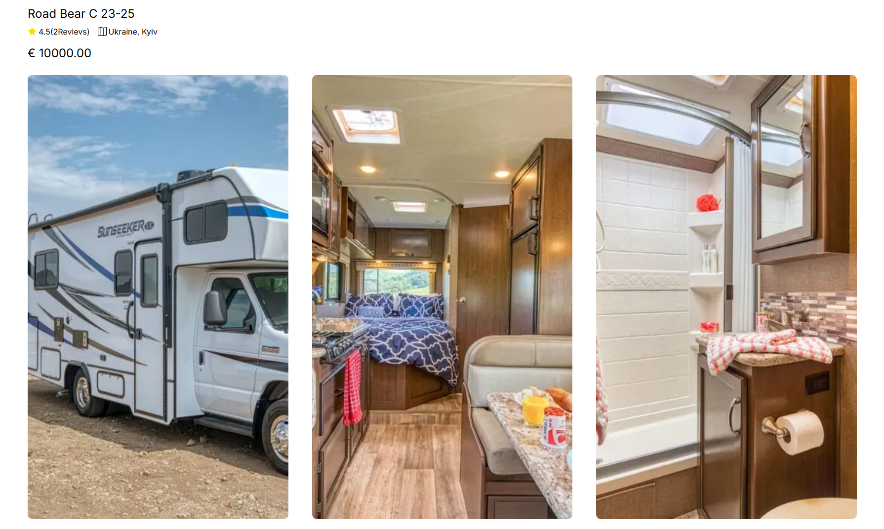
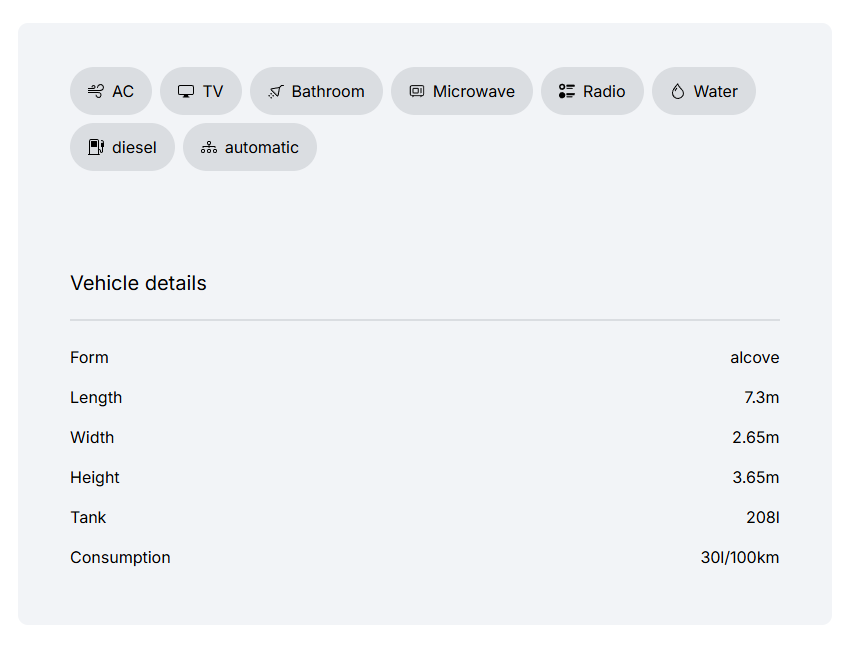
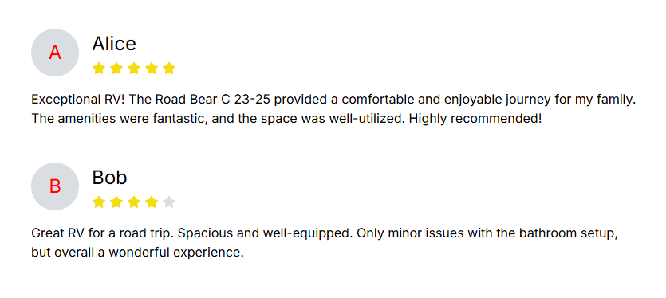
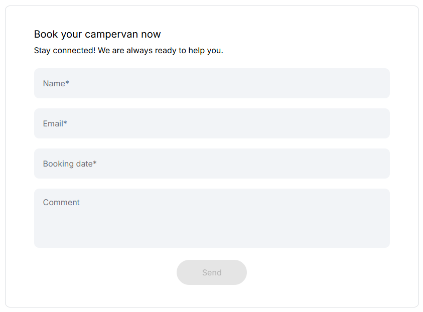
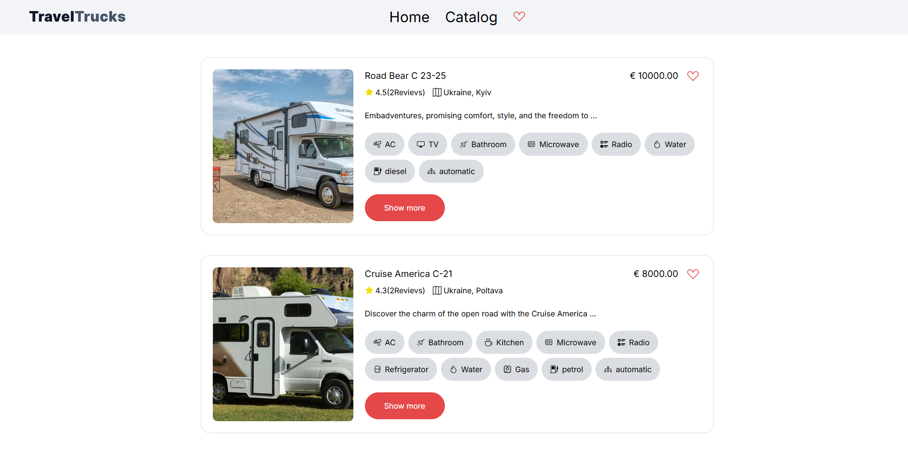

# # Individual project: 🚐 travel trucks

### Description:

Is a convenient web application for searching and renting campers (travel trucks).  
The project is designed to help users quickly and easily find vehicles with the desired features to plan comfortable trips.

### Key Features:

1. **Interface:**

   - Intuitive and user-friendly design.
   - Search trucks by various parameters.
   - Filters by location, fuel type, transmission, and amenities.
   - Date selection for booking through an interactive Date Picker.

2. **Truck Details:**

   - Detailed information for each truck (photos, description, equipment).
   - User reviews.
   - Ability to add trucks to favorites.

3.  **Booking Form:**

    - Fill in a form with name, email, date, and comment for the manager.
    - Data validation using Formik + Yup.

4.  **Favorite Trucks:**

    - Saving selected trucks locally using redux-persist.

5. **Responsive Design:**

   - Proper display and usability on mobile devices, tablets, and desktops.

---

### Development Stages:

1. **Interface Design:**

   - Style selection, layout creation, and UX/UI planning.

2. **Functionality Development:**

   - Implementation of filters, detail pages, booking forms.
   - Setting up Redux state management including favorites.

3. **API Integration:**

   - Using Axios for backend requests.

4. **Testing:**

   - Checking responsiveness, form validation, and functionality on various devices.

5. **Launch and Support:**

   - Project release, collecting user feedback, bug fixes, and feature improvements.

---

### Benefits:

- Fast and convenient camper search with multiple filter options.
- Ability to view detailed information and user reviews.
- Easy booking with confirmation through a form.
- Saving favorite trucks for quick access.
- Mobile-friendly thanks to responsive design.

---

### Technologies Used:

1. **Programming Languages:**

   - TypeScript
   - JavaScript

2. **Frameworks and Libraries:**

   - React
   - Redux Toolkit + redux-persist
   - Formik + Yup
   - React Date Picker
   - React Icons
   - clsx
   - Axios

3. **Other Tools:**
   - CSS (responsive design)
   - Git

---

In addition, the TRAVEL TRUCKS project offers a comprehensive platform for searching, filtering, and booking travel trucks with detailed information on each vehicle’s features and user reviews. Users can easily find trucks matching their preferences, save favorites for quick access, and make bookings through an intuitive form. With its responsive design and seamless integration of multiple technologies, TRAVEL TRUCKS delivers a smooth and reliable experience for planning road trips.
